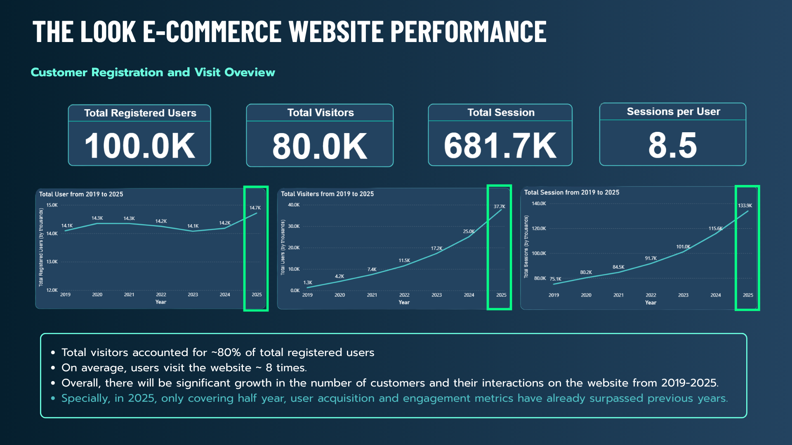
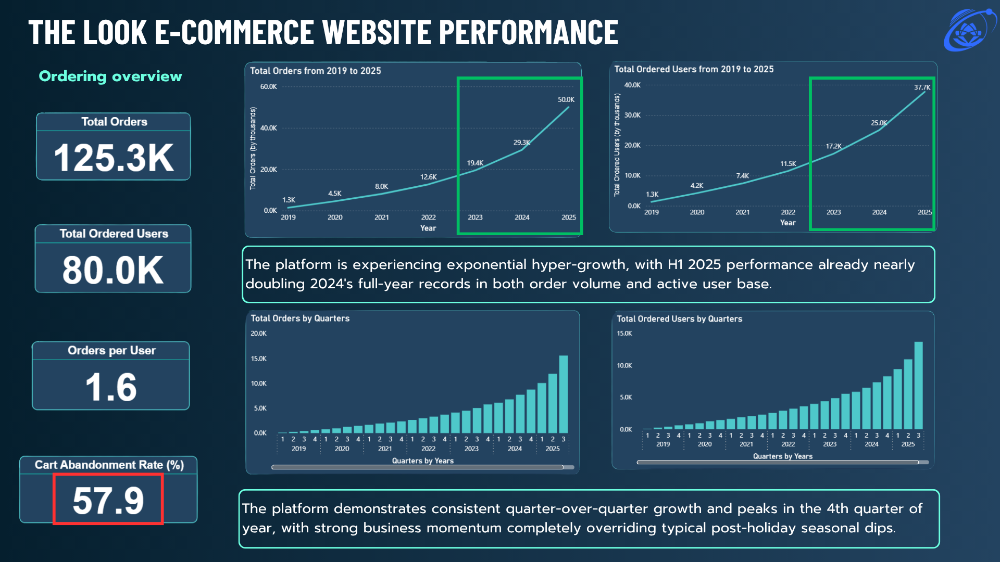
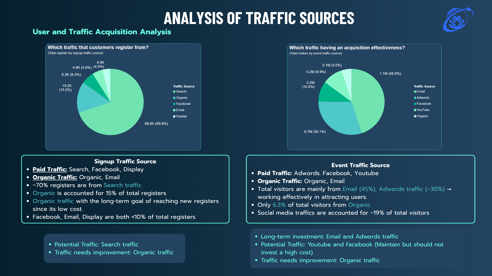
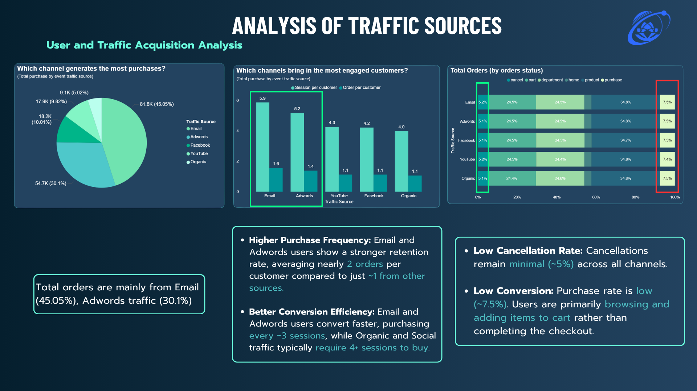
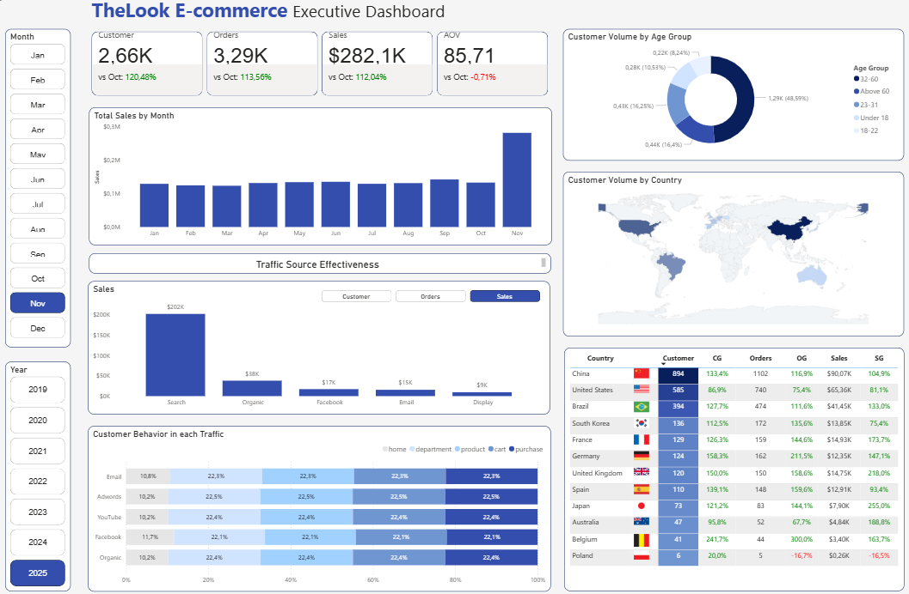

# 📊 TheLook E-Commerce Analytics Project  
### Funnel Optimization & Marketing Performance Analysis  

> 🚀 Data Analyst Portfolio Project  
---

##  Project Summary

This project analyzes the business performance and customer behavior of an e-commerce platform (TheLook) using real-world structured data from Google BigQuery.

The objective is to:

- Identify high-value marketing channels
- Analyze customer behavior using funnel model
- Detect conversion bottlenecks
- Segment customers using demographic & RFM models
- Deliver actionable business insights via Power BI dashboard

This project demonstrates my end-to-end data analytics workflow, from business understanding to dashboard storytelling.

---

## 🏢 Business Context

In a competitive e-commerce environment, companies must:

- Allocate marketing budget efficiently
- Improve conversion rate
- Increase customer retention
- Understand customer segments deeply

This project provides data-driven insights to support those strategic decisions.

---

## 📂 Dataset

**Dataset Name:** TheLook E-Commerce  
**Source:** Google BigQuery  

🔗 **Dataset Link:**   https://console.cloud.google.com/marketplace/product/bigquery-public-data/thelook-ecommerce?hl=en-GB&pli=1&project=gen-lang-client-0216149681
### Main Tables Used

- `Users`
- `Orders`
- `Order Items`
- `Events`

**Time Range:** 2019 – 2025  
**Scale:** 100,000+ users  

---

## 🛠 Tools & Technologies

- Python
- Pandas
- Seaborn
- Scikit-learn
- Statistical Testing (ANOVA)
- RFM Segmentation
- Power BI
- Google BigQuery

---

# 📊 Project Workflow

## 1️⃣ Business Understanding

Defined 3 core analytical questions:

1. Which marketing channels generate the highest business value?
2. Where is the main drop-off point in the customer funnel?
3. Which customer segment contributes most to revenue?

---

## 2️⃣ Data Cleaning & Feature Engineering

- Handled missing geographic values
- Standardized datetime formats
- Created age group categories
- Engineered funnel behavior metrics
- Calculated AOV (Average Order Value)
- Built RFM scoring system

---

## 3️⃣ Exploratory Data Analysis

### 🚀 Business Growth

- Strong growth trend from 2019 to 2025
- 2025 performance surpassed previous years
- Growth pattern overcame traditional seasonality

---

### 📢 Marketing Channel Performance

#### User Acquisition
- 70% registrations from Search Traffic
- Organic: 15%
- Display Ads underperforming

#### Engagement & Revenue Contribution

- Email: 45% of total orders
- Adwords: 30%
- Email & Adwords drive 75% of active traffic

📌 Insight:
Search brings users, but Email & Adwords generate revenue.

---

### 🛒 Funnel Analysis

Customer Journey:

Home → Department → Product → Cart → Purchase → Cancel

Key Observations:

- Users frequently revisit Product pages
- Most sessions end at Product stage
- Purchase occurs only once per session
- Cart abandonment rate ≈ 24.5%
- Conversion rate ≈ 7.5%

📌 Bottleneck Identified:
Product comparison stage causes major drop-off.

---

### 🌍 Geographic Analysis

- 80% of orders come from:
  - China
  - USA
  - Brazil
- China alone ≈ 42%

📌 Risk:
High market concentration dependency.

---

### 👥 Age Group Analysis

- Age 32–60 generates highest total revenue
- ANOVA p-value = 0.4 → No significant AOV difference
- AOV ≈ $50 across all groups

📌 Conclusion:
Revenue dominance comes from customer volume, not higher spending per order.

---

### 💎 RFM Segmentation

Customer Categories:

- Champions
- Loyal
- Promising
- New Customers
- Lost Customers

Key Findings:

- Lost Customers (7,445) > Loyal Customers (6,973)
- Champions generate highest revenue (~$2.8M)
- Promising segment has highest AOV ($157)
- AOV decreases as loyalty increases

📌 Business Concern:
Retention imbalance & declining spending among loyal users.

---

# 📈 Dashboard

An executive Power BI dashboard was developed to visualize:

- Sales trends
- AOV
- Customer growth
- Traffic source effectiveness
- Funnel conversion
- Geographic distribution

🔗 **Dashboard Link:**  https://drive.google.com/drive/folders/1_jBdNLFduKbfcWehlBCnzbI5__aQ4dpT?usp=drive_link_

---

# 🎯 Business Recommendations

1. Reallocate budget toward Email & Adwords
2. Optimize product page UX to reduce drop-off
3. Develop retention strategy for Loyal segment
4. Reduce market concentration risk
5. Implement remarketing campaign for Lost customers

---

# 👤 What I did in this project:

- Defined business problems
- Designed analytical framework
- Led data exploration
- Built RFM segmentation
- Performed statistical testing
- Developed Power BI dashboard
- Generated strategic insights
- Wrote and presented final report

This project reflects my ability to:

- Think analytically
- Translate business problems into data questions
- Perform structured EDA
- Deliver business-oriented insights
- Build clear executive dashboards

---

# 📌 Key Skills Demonstrated

✔ Data Cleaning & Transformation  
✔ Exploratory Data Analysis  
✔ Funnel Analysis  
✔ Marketing Performance Analysis  
✔ Statistical Hypothesis Testing  
✔ Customer Segmentation (RFM)  
✔ Business Insight Generation  
✔ Data Visualization (Power BI)  
✔ Data Storytelling  

---

# 📎 Future Improvements

- Build predictive churn model
- Implement customer lifetime value (CLV) modeling
- Apply cohort analysis
- A/B testing framework for conversion improvement

---

#  Contact

Nguyễn Đăng Khôi  

📧 ngdangkhoiworkmail@gmail.com  
🔗[https://www.linkedin.com/in/%C4%91%C4%83ng-kh%C3%B4i-nguy%E1%BB%85n-677608325/]

